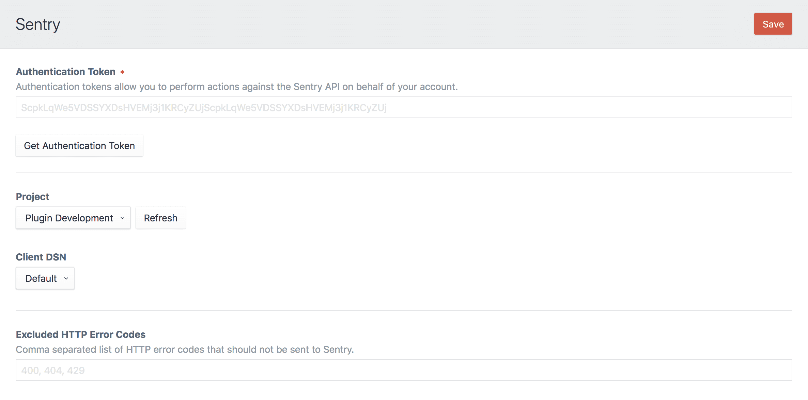

# Sentry plugin for Craft CMS 3.x

Error tracking that helps developers monitor and fix crashes in real time. Iterate continuously. Boost efficiency. Improve user experience.



## Requirements

This plugin requires Craft CMS 3.0.0-RC1, or later.

## Installation

To install the plugin, follow these instructions.

1. Open your terminal and go to your Craft project:

        cd /path/to/project

2. Then tell Composer to load the plugin:

        composer require lukeyouell/craft-sentry

3. In the Control Panel, go to Settings → Plugins and click the “Install” button for Sentry.

## Configuring Sentry

Upon successful installation you will be required to supply an authentication token with `project:read` enabled.

[Authentication tokens are available here](https://sentry.io/api/).

A [Sentry](https://sentry.io) account is required, if you don't already have one [click here to create one](https://sentry.io/signup).

Free & paid plans are available.

## Using Sentry

After entering your Sentry authentication token, you will be required to select a Project along with a corresponding Client DSN.

## Overriding Plugin Settings

If you create a [config file](https://craftcms.com/docs/config-settings) in your `config` folder called `sentry.php`, you can override the plugin’s settings in the Control Panel. Since that config file is fully [multi-environment](https://craftcms.com/docs/multi-environment-configs) aware, this is a handy way to have different settings across multiple environments.

Here’s what that config file might look like along with a list of all of the possible values you can override.

```php
<?php

return [
    'authToken'     => '',
    'project'       => '',
    'clientDsn'     => '',
    'excludedCodes' => '',
];
```

## Sentry Roadmap

Some things to do, and ideas for potential features:

- Dev mode toggle
- Create project from within the CP

Brought to you by [Luke Youell](https://github.com/lukeyouell)
