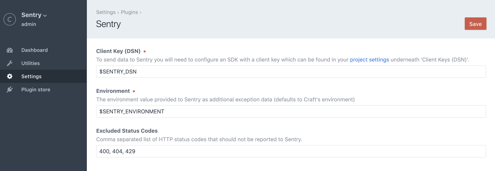

# Sentry plugin for Craft CMS 3

Error tracking that helps developers monitor and fix crashes in real time. Iterate continuously. Boost efficiency. Improve user experience.



## Installation

#### Requirements

This plugin requires Craft CMS 3.1.0, or later.

#### Plugin Store

Log into your control panel and click on 'Plugin Store'. Search for 'Sentry'.

#### Composer

1. Open your terminal and go to your Craft project:

```bash
cd /path/to/project
```

2. Then tell Composer to load the plugin:

```bash
composer require lukeyouell/craft-sentry
```

3. In the Control Panel, go to Settings → Plugins and click the “Install” button for Sentry.

## Configuring Sentry

Upon successful installation you will be required to supply a client key (DSN).

Client keys can be found in your [project settings](https://sentry.io/settings/) underneath 'Client Keys (DSN)'.

A [Sentry](https://sentry.io) account is required, if you don't already have one [click here to create one](https://sentry.io/signup).

Free & paid plans are available.

## Overriding Plugin Settings

If you create a [config file](https://craftcms.com/docs/config-settings) in your `config` folder called `sentry.php`, you can override the plugin’s settings in the Control Panel. Since that config file is fully [multi-environment](https://craftcms.com/docs/multi-environment-configs) aware, this is a handy way to have different settings across multiple environments.

We recommend storing your client key as an environment variable.

Here’s what that config file might look like along with a list of all of the possible values you can override.

```php
<?php

return [
    'enabled'       => true,
    'clientDsn'     => '$SENTRY_DSN', // NOT getenv('SENTRY_DSN')
    'environment'   => '$SENTRY_ENVIRONMENT', // NOT getenv('SENTRY_ENVIRONMENT')
    'excludedCodes' => '400, 404, 429', // Comma-separated list
];
```

Your `.env` file would store the above values like so:

```
SENTRY_DSN=https://55bb06663931567d9ee5bed445c6348a@sentry.io/289748
SENTRY_ENVIRONMENT=my-sentry-environment
```

Brought to you by [Luke Youell](https://github.com/lukeyouell)
